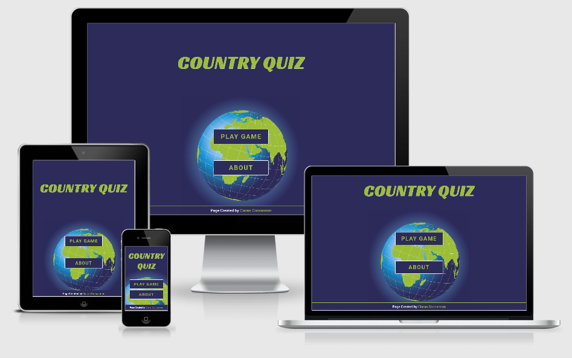
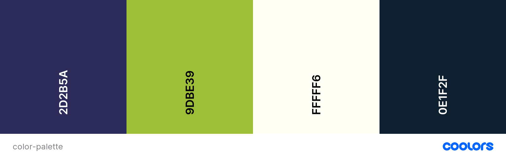
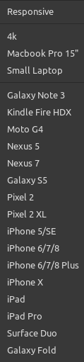
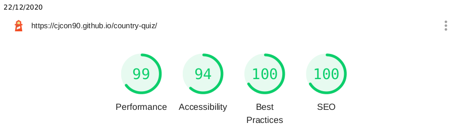

# country-quiz



The purpose of this website is to create a fun and educational quiz game based around knowledge of world nations using the [REST Countries API](https://restcountries.eu/)

A link to the live website is [HERE](https://cjcon90.github.io/country-quiz/)

---

## Table of Contents

- [Overview](#Overview)
- [User Experience (UX)](#UX)
  - [User Stories](#Stories)
  - [Design](#Design)
  - [Previews](#Previews)
- [Features](#Features)
- [Technologies Used](#Technologies)
- [Testing](#Testing)
  - [Functionality](#Functionality)
  - [Validators](#Validators)
  - [Usability](#Usability)
  - [Performance](#Performance)
  - [User Story Testing](#StoryTesting)
- [Bugs & Fixes](#Bugs)
- [Deployment](#Deployment)
- [Credits](#Credits)

---

<a name="Overview"></a>

## Overview

CountryQuiz is a web app, built using the REST Countries API, that tests users knowledge on country flags, capital city names and country populations; it is focused on being both fun and educational.

It provides varying levels of difficulty depending on which region of the world a user selects and this provides continued enjoyment and learning and encourages repeated playthroughs.

---

<a name="UX"></a>

## User Experience (UX)

<a name="Stories"></a>

### User Stories

- **As a first-time visitor / player**

  - I want to quickly be able to find out how the game works
  - I want to be enticed to play the game by fun visuals and colours
  - I want the layout to be clear and uncluttered so that:
    - I can clearly see where I need to click to input my answers and progress through the game
    - I can clearly track my score is and see how far through the game I am at all times
  - I want to be able to save my score so I can try and beat it on my next play
  - I want to feel rewarded when I get a correct answer or get a new high score

- **As a returning visitor / player**

  - I want to be able to skip any tutorial and go straight into the game
  - I want my previous high score to be saved
  - I was there to be a large pool of questions so that my playing experience is different on each playthrough
  - I want to be able to increase the difficulty and take on new challenges as I get better at the game

- **As the site owner**
  - I want to encourage new users to play the game for the first time
  - I do not want first time players to be confused by the game in any way
  - I want there to be an option for users to share the app through their social media networks
    - I want this option/button be visible after every playthrough so that both first-time players and returning players alike are encouraged to share the app
  - I want the website to be both fun and educational, increasing the likelihood that:
    - users will enjoy the app
    - users will share the app
  - I want the app to work without any errors in terms of the questions asked or the scoring system

<a name="Design"></a>

### Design

#### Imagery

- The main game element of the app is based around the images of country flags on which the user is tested. These images are generated through the REST Countries API, and can represent any country in the world - based on which region or difficulty the user has selected.

- For the landing page of the app, I wanted a single image that would symbolise the subject matter of the game whilst providing a fun visual effect that would excite users to play the game.

- For this I chose an illustration of the earth by [Alfonso de Tomas, sourced on Shutterstock](https://www.shutterstock.com/image-vector/europe-map-africa-russia-asia-north-229383577)
- This image is animated on loading the main menu of the page, growing in size which again brings life into the design of the app.


#### Colour Scheme

- The main colour scheme for the app was structured around the selected main central image of the earth in space.

  - **Primary Colour** | _Space Cadet_ | #20503C | a dark, soft blue that works very well as a 'night mode' style background colour.

  - **Secondary Colour** | _Android Green_ | #9DBE39 | a bright green that contrasts nicely with the primary dark blue. It's brightness and vibrancy adds a touch of fun to the styling, a requirement as outlined in the user stories.

  - **White Colour** | _Baby Powder_ | #FFFFF6 | a soft white that does not appear sharp or overly bright against the two main app colours.

  - **Black Colour** | _Rich Black FOGRA 29_ | #0E1F2F | a soft black that again does not appear too sharp or overly dark against any of the app colours.

- As the country flags appearing within the app will feature many bright colours throughout, I kept the amount of colours used in the app to a minimum, as too many additional colours would easily risk clashing against the flags or make the game page overwhelming in terms of colour content.



#### Typography

- I chose two fonts to use within the document.

  - The default font for areas where legibility was the key factor, such as paragraphs and questions, I chose the popular [Roboto font](https://fonts.google.com/specimen/Roboto#standard-styles) that allows for a natural reading rhythm.

  - For the headings, I wanted a font that was clearly legible but fit with the need of fun visuals, as outlined in the user stories. For this I chose [Racing Sans One](https://fonts.google.com/specimen/Racing+Sans+One), a unique font due to its high contrast sans that creates a fun visual effect.

#### Sound

- There are five sounds implemented within the app which were all sourced from [ZapSplat](https://www.zapsplat.com/)

  1.  [Correct answer](https://www.zapsplat.com/music/bell-chime-notification-high-pitched-metallic-good-for-apps-games-and-other-ui-3/)

  1.  [Wrong Answer](https://www.zapsplat.com/music/game-error-tone-1/)

  1.  [Bonus Points Awarded](https://www.zapsplat.com/music/notification-alert-bell-chime-good-for-alerting-user-of-event-or-message-etc-4/)

  1.  [High Score](https://www.zapsplat.com/music/game-tone-bright-and-warm-synth-win-award-1/)

  1.  [Perfect Score](https://www.zapsplat.com/music/game-tone-bright-warm-and-magical-win-award-or-level-up/)

- The correct and wrong answer sounds were selected to be subtle and short in length as they would be heard multiple times in the app. They were also selected to be easily recognisable in terms of simulating achievement and error.
  - The addition of a unique sound for getting bonus points provides an extra reward to the user, and also makes the in-game sounds less repetitive
- The High Score and Perfect Score sounds were selected to sound somewhat related to each other (both rising melodic tones), with the sound for a perfect score being more complex and higher in tone to also give users an additional feeling of reward, in line with the user stories.

#### Wireframes

- Wireframes were created using Balsamiq
- The website was designed mobile-first

  1.  [Mobile Wireframes](docs/wireframes/wireframe-mobile.pdf)
  2.  [Tablet Wireframes](docs/wireframes/wireframe-tablet.pdf)
  3.  [Desktop Wireframes](docs/wireframes/wireframe-desktop.pdf)

##### Variation from Wireframes

- The wireframes were initally created with a scrolling image of all the country flags acting as the header background.
- When applying this in practice, the end result looked dated and garish so I changed the primary menu design to a single image of a globe, and placed it behind the main menu buttons rather than behind the title.

---

<a name="Previews"></a>

### Previews

As opposed to creating screenshots of the app, in order to preview the app as clearly as possible and demonstrate alignment to the User Stories as outlined earlier, I have provided recordings of a full playthrough on both Desktop and Mobile (using Chrome browser in both cases)

1. [**Desktop Playthrough Video**](https://res.cloudinary.com/cjcon90/video/upload/v1608666800/codeinstitute/country-quiz/desktop_playthrough_wg2oc6.webm)
2. [**Mobile Playthrough Video**](https://res.cloudinary.com/cjcon90/video/upload/v1608666804/codeinstitute/country-quiz/mobile_playthrough_z7zazm.mp4)

## Features

#### Navigation

- Clear navigation to go straight into playing the game on first loading the app
  - Important for returning users who do not need any explanation on the rules.
- Clear navigation to the 'About' section on first loading the app
  - Important for first-time players
- All link text throughout the app is styled in a way that differentiates it from all non-interactive text
- All link and interactive buttons have additional styles when the user hover over or interact with them
- Any disabled buttons are clearly styled so users are not drawn to click on them
- Page auto-focuses to the text input on each question, to create less clicks for the user to progress through the game
- At the end of game user is presented with a list of navigation options
  - Repeat the game under the current region / difficulty settings
  - Play again but choose different region / difficulty settings
  - Exit the game and return to the main menu
    - This is useful for players who need to revisit the About section for any extra clarity

#### About Section

- The About section explains the game to new players:
  - The subject of the game
  - What questions are asked
  - How the region / difficulty selectors work
  - How points & bonus points are scored
  - Where the data comes from
  - How to report any inaccurate data
- Following the explanation there is a link to continue into the game without having to go back to the main menu

#### Game Mode Selection

- Any countries that do not have a population or a capital city name are automatically filtered out before any selection
- Users are given 6 filters for what region they want to play with:
  1.  Africa
  2.  Asia
  3.  Americas
  4.  Europe
  5.  Oceania
  6.  The World
- Users are then given a choice of 4 difficulties, that will filter the remaining countries based on population
  1.  Easy (20,000,000+ population)
  2.  Medium (5,000,000+ population)
  3.  Hard (150,000+ population)
  4.  Expert ()
      - The specific population numbers that determine the difficulty are not given in the app's About section, as this could reveal some of the in-game answers for the user.
      - 'Easy' and 'Medium' modes are disabled for Oceania, as there is not enough countries with a population of 5,000,000+

#### Game Functionality

- A random 5 countries are selected based on the user's chosen filters
- 3 questions are asked for each country
  - What is the country's name (based on the shown flag)
  - What is the countries capital city
  - What is the country's population
    - To generate the population options, an array of 5 populations is generated in the format: `[0.5x, 0.75x, 1x, 1.25x, 1.5x]`
    - Three options are then sliced from this array, so the options always contain the actual population, and appear in ascending order
- Each correct answer is worth 5 points
  - Players earn a bonus 5 points for answering all questions correctly on an individual country
- If a user gets an answer incorrect, the correct answer is displayed on screen.
- The user's progress in the game is displayed showing how many countries they have answered out of 5
- The user's score is always visible and updated as they progress through the game
- For text input questions, the user's keyboard is auto-focused to reduce necessary clicks and increase ease of play
  - Text answers can also be inputted via the Enter key, to make it easier for desktop players
  - For mobile players, the page automatically scrolls to the bottom on input of text, to prevent 'Submit' and 'Next' buttons being hidden by soft keyboard

#### End Game Screen

- The user's final score and high score are displayed
- `localStorage()` is used to keep track of a user's high score
- If a user gets a new high score, they are notified with text and sound
- If a user scores 100/100, the text will display "Perfect Score", and a different tone will play
- There are navigation buttons as outlined above
- There is an option for the user to share their score with a link to the game in both Twitter and Facebook
  - The shared link will display: "_I just scored ${score} points in the Country Quiz Challenge! Can you do better? [https://cjcon90.github.io/country-quiz/](https://cjcon90.github.io/country-quiz/)_"

<a name="Technologies"></a>

## Technologies Used

### Languages Used

- HTML5
- CSS3
- JavaScript

### Frameworks, Libraries and Programs Used

- [Sass](https://sass-lang.com/) - Technology to organise and compile CSS from separate .scss files, and make use of Sass variables and functionalities
- [Node Package Manager](https://www.npmjs.com/) - Used to install the following packages through the Node.js runtime environment:
  - [Node-Sass](https://www.npmjs.com/package/node-sass) - to natively compile SCSS files to CSS
  - [Live Server](https://www.npmjs.com/package/live-server) - to launch a development server and view live changes to project
  - [npm-run-all](https://www.npmjs.com/package/npm-run-all) - to run node-sass and live-server concurrently with a single command
  - [PostCSS CLI](https://www.npmjs.com/package/postcss-cli) - a tool to install CSS tools and plugins, such as:
    - [Autoprefixer](https://www.npmjs.com/package/autoprefixer) - a Post CSS plugin to parse CSS and adds vendor prefixes
- [Font Awesome](https://fontawesome.com/) - Used to add facebook and twitter icons
- [Google Fonts](https://fonts.google.com/) - Used to import Racing Sans One and Roboto fonts for use in project
- [VSCode](https://code.visualstudio.com/) - Chosen IDE for writing code
- [Balsamiq](https://balsamiq.com/) - For creating wireframes
- [ImageMagick](https://imagemagick.org/index.php) - For resizing images through command line
- [TinyJPG](https://tinyjpg.com/) - For compressing .jpg images to improve performance
- [Shutterstock](https://www.shutterstock.com/home) - For sourcing primary 'globe' image
- [ZapSplat](https://www.zapsplat.com/) - For sourcing game sounds
- [Responsive Design Checker](https://responsivedesignchecker.com/) - For extensive testing web page on various screen sizes

<a name="Testing"></a>

## Testing

<a name="Functionality"></a>

### Functionality Testing

- **Home Page / Main Menu**

  - Both links lead to correct destination
  - Both links give visual feedback when hovered over or pressed
  - It is possible to navigate to both links via the Tab key
  - The main menu animation is centered, with the globe falling behind the main menu buttons in all the tested viewports
  - The main menu screen starts with a blank screen of the primary color with none of the elements on the page visible before coming into view via their animation

- **About Section**

  - All links lead to correct destination
  - All links give visual feedback when hovered over or pressed
  - It is possible to navigate to all links via the Tab key
  - All external links open in a new tab
  - The 'mailto' link opens an email to cjcon90@pm.me in the user's default email application
  - The "How to Play" header stays at the top of page on all devices, taking up 100% of viewport width
  - Vertical overflow in the about section text scrolls to ensure that the web page height = 100% of the viewport height on all devices.

- **Region/Difficulty Selectors**
  - I added a list of console outputs throughout the game to ensure that the game was functioning as expected:
    - Region selection:
      - `` console.log(`\nRegion selected: ${regionSetting}`) ``
      - `` console.log(`Countries After Region Select: ${countryList.length}`); ``
    - Difficulty selection & minimum population:
      - `` console.log(`\nDifficulty selected: ${difficultySetting}`); ``
      - `` difficultySetting === "expert" ? console.log(`Minimum population: none`) : console.log(`Minimum population: ${difficulty[difficultySetting].toLocaleString()}`); ``
      - `console.log("Countries After Difficulty Select: " + countryList.length);`
    - Details of final countries selected
      - `console.log("\nRandom 5 countries selected for game:");`
      - `` for (country of selectedCountries) {console.log(`name: ${country.name}, capital: ${country.capital}, population: ${country.population.toLocaleString()}`);} ``
    - Population testing: ensuring that actual population is featured in answer options and placed at a random index
      - `` console.log(`\nPopulation options: ${popOptions}`); ``
      - `` console.log(`Actual population: ${answers[2]}`); ``
      - `` console.log(`Actual Population is in options? ${popOptions.includes(answers[2]) ? "Yes" : "No"}`); ``
      - `` console.log(`Actual Population is in options? ${popOptions.includes(answers[2]) ? "Yes" : "No"}`); ``
    - Correct answer testing
      - `console.log({ currentAnswer }, answer.toString());`
      - `if(isCorrect)`
        - `` console.log(`${streak}/3 on country`); ``
        - `if (streak === 3)`
          - `` console.log(`Score +10!`); ``
        - `else`
          - `` console.log(`Score +5!`); ``
    - Final score testing
      - `` console.log(`Final score: ${score}`); ``

**A JS file featuring the above console logs has been left in the project folder as "gameWithTestLogs.js" for reference purposes. They have since been removed from the app's main JS file**

- **Game counters**
  - Progress counter updates successfully
    - Shows progress as n/5 countries, and increments after each completed population question
  - Score counter updates successfully and is accurate to expected game score
- **Country Flag**
  - Flag is always visible
  - Flag is always accurate to the country being tested
  - Entire flag is visible on all viewports
  - Image properties adjust accordingly to make Nepal fit on all viewports (and reverts afterwards):

```javascript
// if the country is Nepal then set the flag object-fit to contain, to compensate for unique aspect ratio
if (answers[0][0] === "nepal") {
  flag.setAttribute("style", "object-fit: contain; border: none; box-shadow: none; height: 100%");
} else {
  // else set the object-fit to cover
  flag.setAttribute("style", "object-fit: cover; border: solid 0.2rem $color-white; box-shadow: 0 0 .8rem rgba(0,0,0,.5); height: auto;");
}
```

- **Question Text**

  - Every third question asks "What is the name of this country?"
  - The following question will ask "What is the capital of (country)?", with the country name being capitalised and accurate to the country being asked
  - The following question will ask "What is the population of (country)?", with the country name being capitalised and accurate to the country being asked

- **Text Input**

  - For the country name and capital city questions, a text input is visible
  - The text input is auto focused so the user can begin inputting text without having to click on the input
  - The text input gives visual feedback that it is currently active
  - On desktops, users can input their answer via the Enter key
  - Typing in the text input will scroll to the bottom of the page so that the Submit and Next buttons are not hidden behind mobile soft keyboard
  - Population selection buttons are not visible when the text input is shown

- **Population Buttons**

  - Population buttons appear for the population question for each country
  - Text input is not visible when population buttons are shown
  - Button gives visual feedback when selected
  - Selected button corresponds to answer given when "Submit" button is pressed
  - User can change their mind, and selecting another button will change their stored answer
  - Buttons always feature three different options to select
  - The correct answer is always featured in the options
  - Options are given in ascending order
  - The correct answer randomly appears as the 1st, 2nd or 3rd option
  - Populations are clearly legible and thousands/millions are separated by commas
  - Populations fit within their buttons, and buttons fit within the page, on all viewports

- **Answer Text**

  - Text is invisible until user submits answer
  - Text disappears when user moves to next question
  - Text displays "CORRECT" or "WRONG" depending on whether user is correct or incorrect
  - Text displays as green is user is correct
  - Text displays as red if user is incorrect
  - if user is incorrect, a subparagraph will display "The correct answer is (answer)"
  - The displayed answer is correct for the question being asked

- **Submit/Next Buttons**
  - Buttons give visual feedback when hovered over or pressed
  - On question load, submit button is enabled and next button is disabled
  - When a user submits an answer (whether via submit button or Enter key):
    - The submit button is disabled
    - The next button is enabled
    - The next button is auto-focused
  - On pressing the Next button:
    - The Next button is disabled
    - The Submit button is enabled
    - The next question is loaded
    - If all questions have been asked, the final score modal appears
- **End Game Screen/Modal**
  - Animations (modal appearing from left and background blur) work on all devices
  - End Game Scores
    - High Score is recorded in the browser from previous sessions
    - High Score is reset to zero when playing in incognito mode or a new browser
    - Beating the previous high score successfully plays a sound and shows "New High Score" text in all browsers
    - Getting a score of 100 successfully plays a separate sound and shows "Perfect Score" text in all browsers
  - Links & Buttons
    - All links/buttons give feedback when pressed or hovered over
    - _Play Again_ button repeats the quiz with 5 random countries and brings user to Q1
    - Change Region / Difficulty and Exit Game buttons bring user to game menu or main menu accordingly
    - Facebook and twitter buttons both successfully bring user to the respective social media website with a preprepared post, featuring a link to the app
      - On mobiles, this successfully opens a post in the default facebook/twitter app (if installed)

<a name="Validators"></a>

### Validators

#### HTML5

Tested with [W3C Markup Validation Service](https://validator.w3.org/)

- 1 error (in 4 locations throughout app): **Section lacks heading**
  - Not relevant as game sections do not require heading in this use case

#### CSS

Tested with [W3C CSS Validation Service](https://jigsaw.w3.org/css-validator/validator)

- **Error: Value Error : height Parse Error 100)**
  - This is related to the body height of `height: calc(var(--vh, 1vh) * 100);` which fixes viewport width issues on mobile browsers.
  - Code was sourced from [this CSS Tricks article](https://css-tricks.com/the-trick-to-viewport-units-on-mobile)
  - I also included a fallback of `height: 100vh;` within the code for browsers that do not support Custom Properties
- **Error: Property backdrop-filter doesn't exist : none**
- **Error: Property backdrop-filter doesn't exist : blur(2px)**
  - These errors are related to my endgame modal animation, whereby the background underneath the modal is blurred
  - use of `backdrop-filter` is following guidance in [Mozilla Docs](https://developer.mozilla.org/en-US/docs/Web/CSS/backdrop-filter)
  - Despite errors, the animation works on all tested browsers. other than Firefox
  - [CanIUse.com](https://caniuse.com/?search=backdrop-filter) confirmed that backdrop-filter is not yet supported in Firefox, [is currently under consideration](https://platform-status.mozilla.org/#css-backdrop-filter)
- **Webkit Errors**
  - Any code with `-webkit` prefix (inserted by auto-prefixer) fails in CSS validation

#### JavaScript

Tested with JSHint NPM Package](https://www.npmjs.com/package/jshint)

- Installed JSHint **globally** using: `npm install -g jshint`
- To specify my JS document as ECMAScript version 6, I followed [this StackOverflow Post](https://stackoverflow.com/a/40620967), I added a `.jshintrc` file in the root of my app wiht the rule:

```javascript
{
  "esversion": 6
}
```

##### app.js

- No errors

##### game.js

- **Error: Function declarations should not be placed in blocks. Use a function expression or move the statement to the top of the outer function.**
  - This error is in relation to the `submitFunc()` and `inputFunc()` functions that are both found within the `submitAnswer()` function
  - The reason these functions are used _inside_ the larger submitAnswer() function is that I needed them to access the `answer` and `answerInput` variables, but also needed to keep both functions free of arguments, so that I could easily remove them using `removeEventListener`
  - Attempts to remove these functions brought bugs such as either the text input or submit button stacking answers from previous questions.

<a name="Usability"></a>

### Usability

- Web page was extensively tested in various browsers:
  - Google Chrome (desktop | Linux)
  - Firefox (desktop | Linux)
  - Samsung Internet (mobile | Android)
  - Chrome (mobile | Android)
  - Brave (mobile | Android)
- Responsiveness was tested extensively in both [Chrome DevTools](https://developers.google.com/web/tools/chrome-devtools) and [Responsive Design Checker](https://responsivedesignchecker.com/)
- Devices tested within DevTools were:
  - 
  - Custom viewport sizes I created for testing purposes were:
    - 4k: 3840 x 2160
    - Macbook Pro 15: 2880 x 1800
    - Small laptop: 1366 x 768

<a name="Performance"></a>

### Performance

- Every page of the app was tested in [Lighthouse](https://developers.google.com/web/tools/lighthouse), achieving high scores for Performance, Accessibility, Best Practices and SEO across the board.



- [Home Page Desktop Results](docs/testing/lighthouse/home_desktop.pdf)
- [About Page Desktop Results](docs/testing/lighthouse/about_desktop.pdf)
- [Game Desktop Results](docs/testing/lighthouse/game_desktop.pdf)
- [Home Page Mobile Results](docs/testing/lighthouse/home_mobile.pdf)
- [About Page Mobile Results](docs/testing/lighthouse/about_mobile.pdf)
- [Game Mobile Results](docs/testing/lighthouse/game_mobile.pdf)

  - Accessibility points were lost on main menu page, due to heading animation, whereby Lighthouse did not detect the heading as having sufficient contrast
  - Once animation was complete - heading had contrast of **6.14**

<a name="StoryTesting"></a>

### User Stories

- **As a first-time visitor / player**

  - I want to quickly be able to find out how the game works:
    - :heavy_check_mark: **An explanatory About page is clearly labelled, accessible in one-click on loading the app and explains the game in full for new users**
  - I want to be enticed to play the game by fun visuals and colours:
    - :heavy_check_mark: **Game is bright and colorful. It features multiple animations throughout and additionally features fun sounds**
  - I want the layout to be clear and uncluttered so that:
    - I can clearly see where I need to click to input my answers and progress through the game:
      - :heavy_check_mark: **Navigation buttons are clearly labelled. They react to user interaction. 'Submit' and 'Next' buttons are disabled and enabled accordingly to prevent any confusion for the user**
    - I can clearly track my score is and see how far through the game I am at all times:
      - :heavy_check_mark: **Progress and score counters are clearly visible throughout the game**
  - I want to be able to save my score so I can try and beat it on my next play:
    - :heavy_check_mark: **Score successfully saves in localStorage on all tested browsers**
  - I want to feel rewarded when I get a correct answer or get a new high score:
    - :heavy_check_mark: **User is rewarded with green text and sounds for correct answers, bonus points, high scores and perfect scores**

- **As a returning visitor / player**

  - I want to be able to skip any tutorial and go straight into the game
    - :heavy_check_mark: User can go straight into the game from the main menu
  - I want my previous high score to be saved
    - :heavy_check_mark: **Score successfully saves in localStorage on all tested browsers**
  - I was there to be a large pool of questions so that my playing experience is different on each playthrough
    - :heavy_check_mark: **A total pool of 245 countries and various regions and difficulties guarantee long-term replayability**
  - I want to be able to increase the difficulty and take on new challenges as I get better at the game
    - :heavy_check_mark: **On the hardest difficulty, the game tests on countries with micro-populations as small as 30 people, ensuring difficulty for even the most knowledgeable players**

- **As the site owner**
  - I want to encourage new users to play the game for the first time
    - :heavy_check_mark: **Fun animations, colours, sounds and welcoming explanation in the About section achieve this**
  - I do not want first time players to be confused by the game in any way
    - :heavy_check_mark: **An explanatory About page is clearly labelled, accessible in one-click on loading the app and explains the game in full for new users**
  - I want there to be an option for users to share the app through their social media networks
    - I want this option/button be visible after every playthrough so that both first-time players and returning players alike are encouraged to share the app
      - :heavy_check_mark: **Facebook and Twitter share buttons are clearly visible at the end of every playthrough, and share the page URL with a custom message on both platforms**
  - I want the website to be both fun and educational, increasing the likelihood that:
    - users will enjoy the app
    - users will share the app
      - :heavy_check_mark: **User testing feedback was positive across the board. When sharing the app within the CodeInstitute Slack channel, one user described the app as "addictive"**
      - :heavy_check_mark: **User feedback also commented that the game was difficult, even for their own region. The difficulty and variety ensures educational aspect of the app**
  - I want the app to work without any errors in terms of the questions asked or the scoring system
    - :heavy_check_mark: **Thorough testing throughout the app ensured that it is an error free experience for all users**

<a name="Bugs"></a>

## Bugs

**Bug**: Nepal flag was causing issues on various screens due to it being taller than it is wide

**Fix**: The following code fixed the issue:

```javascript
// if the country is Nepal then set the flag object-fit to contain, to compensate for unique aspect ratio
if (answers[0][0] === "nepal") {
  flag.setAttribute("style", "object-fit: contain; border: none; box-shadow: none; height: 100%");
} else {
  // else set the object-fit to cover
  flag.setAttribute("style", "object-fit: cover; border: solid 0.2rem $color-white; box-shadow: 0 0 .8rem rgba(0,0,0,.5);");
  // Set a separate remove attribute instruction, as setting height: auto on flag element was causing issues on small desktop view
  flag.removeAttribute("style", "height: 100%");
}
```

---

**Bug:** Progress increment event listeners were stacking, and incrementing by amounts up to 12 every time the "Next" button was clicked.

**Fix:** After checking the button event listeners in Chrome Dev Tools, I noticed the 'once' parameter for event listeners listed.

After searching the functionality of this parameter I followed [this dev.to guide](https://dev.to/cilly_boloe/addeventlistener-once-js-bits-565d) to use `once` to prevent by EventListeners from stacking.

This parameter was useful throughout my app in various other event listeners.

---

**Bug:** Certain countries were not accepting correct answers in terms of the country name. Example: answering 'Russia' for 'Russian Federation' was coming back as incorrect.

**Fix:** Added alternative spellings and foreign translations (found in the REST Country API) to the accepted answers within the app:

```javascript
let answers = [];
for (let country of list) {
  // create array of country flags for each question
  questionFlags.push(country.flag);
  // Create a names array of the official country name, the native country name, and alternative spellings
  let names = [country.name.toLowerCase(), country.nativeName.toLowerCase()];
  for (let altName of country.altSpellings) {
    if (!names.includes(altName.toLowerCase())) names.push(altName.toLowerCase());
  }
  for (let translation of Object.values(country.translations)) {
    if (translation && !names.includes(translation.toLowerCase())) names.push(translation.toLowerCase());
  }
  //return an answer array of 5 subarrays in format:
  // [names answers, capital answer, population answer]
  answers.push([names, country.capital.toLowerCase(), country.population]);
}
```

---

**Bug:** Capital cities with accented or hyphenated names were not being accepted as correct answers. Example: 'Brasilia' was not accepted for 'Brasília' because of the accented letter i.

**Fix:** I modified [this code by Marcelo Ribeiro](https://gist.github.com/marcelo-ribeiro/abd651b889e4a20e0bab558a05d38d77) to create a function that would disregard any accents, hyphens or apostrophes in Capital City names:

```javascript
function removeAccent(str) {
  var map = {
    " ": "-",
    "": "'",
    a: "á|à|ã|â|å|À|Á|Ã|Â|Å",
    e: "é|è|ê|ē|É|È|Ê|Ē",
    i: "í|ì|î|Í|Ì|Î",
    o: "ó|ò|ô|õ|Ó|Ò|Ô|Õ",
    u: "ú|ù|û|ü|Ú|Ù|Û|Ü",
    c: "ç|Ç",
    n: "ñ|Ñ",
  };
```

---

**Bug:** If the user answered questions quickly, then the correct sound audio would not play - as the original sound file was still playing

**Fix:** Following [Wes Bos' Drum Machine Project](https://www.youtube.com/watch?v=VuN8qwZoego), I used `.currentTime = 0` to reset the audio and ensured that it played which each answer given.

---

**Bug:** A user in the CodeInstitute Slack channel identified that the Population Buttons did not give visual feedback when pressed. Browser being used was Safari.

**Fix:** After researching the issue, this appeared to be an issue with the `:focus` pseudo class in Safari, [as outlined here](https://www.xspdf.com/resolution/53073516.html#:~:text=Css%20%3Afocus%20not%20working%20in%20safari&text=Just%20use%20tabindex.,the%20href%20just%20in%20case). Problem was fixed by adding `tabindex="0"` to each of the population buttons.

## Deployment

### Publishing

This website was published using [GitHub Pages](https://pages.github.com/). The procedure is outlined below.

1. Login to your account on [Github](https://github.com/).
2. Within the project you wish to deploy, go to 'Settings'
3. Scroll down till you see 'GitHub Pages' heading.
4. Under the 'Source' click on the dropdown and select 'main branch'
5. You will now see the link for your GitHub Pages deployment on the right hand side of your repository page under "Environments"
6. Your GitHub Pages deployment is always located at https://[github-username].github.io/[repository-name]

### Forking

If you wish to contribute to this website you can Fork it without affecting the main branch by following the procedure outlined below.

1. Login to your account on [Github](https://github.com/).
2. Locate the [Repository](https://github.com/cjcon90/country-quiz) used for this project.
3. On the right-hand side of the Repository name, you'll see the 'Fork' button.
4. This will create a copy in your personal repository.
5. Once you're finished making changes, return to original repository and press 'New Pull Request' to request your changes to be merged into the original project.

### Cloning

If you wish to clone or download this repository to your local device you can follow the procedure outlined below.

1. Login to your account on [Github](https://github.com/).
2. Locate the [Repository](https://github.com/cjcon90/country-quiz) used for this project.
3. Under the Repository name, click the green 'Code' button preceded by a down facing arrow
4. Copy the text visible in the dropdown tab (or press the clipboard icon next to the text field)
5. Open your Terminal and go to a directory where you want the cloned directory to be copied in.
6. Type `Git Clone` and paste the text you copied from the GitHub (CTRL + Shift + C to paste within a terminal window) and press `Enter`

### Installing Node & Dependencies

To install the NPM dependencies used within this document after cloning the project:

1. Download the [Node.js installer for your OS](https://nodejs.org/en/download/) and follow the install instructions. For Linux systems, follow the [installation via a package manager instructions here](https://nodejs.org/en/download/package-manager/)
2. Verify your installation by opening a terminal window and entering `node –v` which will display the Node.js version installed on your system. You can do the same for NPM with `npm -v`
3. To install all the NPM packages and dependencies within the project, open a terminal within the projects root folder and enter `npm install`. This will install all modules listed as dependencies in package.json

### Live Server and Sass

Note that within the project's package.json file under "scripts" there is the following entries:
```javascript
"scripts": {
    "watch:sass": "node-sass assets/scss/app.scss assets/css/app.css -w",
    "devserver": "live-server",
    "start": "npm-run-all --parallel devserver watch:sass",
    "compile:sass": "node-sass assets/scss/app.scss assets/css/app.comp.css",
    "prefix:css": "postcss --use autoprefixer -b 'last 4 versions' assets/css/app.comp.css -o assets/css/app.prefix.css",
    "compress:css": "node-sass assets/css/app.prefix.css assets/css/app.css --output-style compressed",
    "build:css": "npm-run-all compile:sass prefix:css compress:css"
  }
```
#### Running a development Server

While in the project's root folder, you can enter the following terminal commands:
- `npm run watch:sass` watches for changes in the project and compiles SCSS code into the project's main CSS file on save
- `npm run devserver` will run a live development server
- **`npm run start` will run these two processes in a single terminal command**

#### Building CSS File for deployment
While in the project's root folder, you can enter the following terminal commands:
- `npm run compile:sass` compiles the project's SCSS code into a separate **app.comp.css** file
- `npm run prefix:css` parses the previously compiled CSS file and adds vendor prefixes to CSS rules, and saves as a new **app.prefix.css** file
- `npm run compress:css` compiles and compresses the prefixed and outputs it into the project's main CSS file, to minify CSS file size.
- **`npm run build:css` will run these above processes in order to fully compile and compress the project's CSS, ready for deployment**

<a name="Bugs"></a>
## Credits

- Using `srcset` to create responsive images of different sizes found on [CSS Tricks](https://css-tricks.com/responsive-images-css/)
- Updating site metadata following [Open Graph Protocol](https://ogp.me/) guide.
- Marcelo Ribeiro for their [remove accents function](https://gist.github.com/marcelo-ribeiro/abd651b889e4a20e0bab558a05d38d77)
- Marijn Haverbeke for successfully removing event listeners, as in Chapter 15 of his book [Eloquent Javascript](https://eloquentjavascript.net/15_event.html)
- Jonas Schmedtmann for his [*Advanced CSS and Sass: Flexbox, Grid, Animations and More!* Udemy course](https://www.udemy.com/course/advanced-css-and-sass/) which inspired:
	- My sass setup and file organisation
	- My package.json scripts for compiling SCSS into CSS
	- Using mixins for centering content and as breakpoint media queries
	- My animations used within the project
- DigitalOcean for [this minimal CSS reset](https://www.digitalocean.com/community/tutorials/css-minimal-css-reset)
- CSS Tricks for [using custom properties to disregard address bar when calculating vh on mobile browsers](https://css-tricks.com/the-trick-to-viewport-units-on-mobile)
- Sonya Moisset for [sentence case function code](https://www.freecodecamp.org/news/three-ways-to-title-case-a-sentence-in-javascript-676a9175eb27/)
- This StackOverflow post for [auto-scrolling to bottom of page o text input](https://stackoverflow.com/a/54575955)
- This StackOverflow post for [adding a high score to local storage](https://stackoverflow.com/questions/29370017/adding-a-high-score-to-local-storage)
- My CodeInstitute mentor Maranatha Ilesanmi for assisting in planning and preparing for milestone-project and optimizing code
- Codeinstitute Slack channel for peer code review

